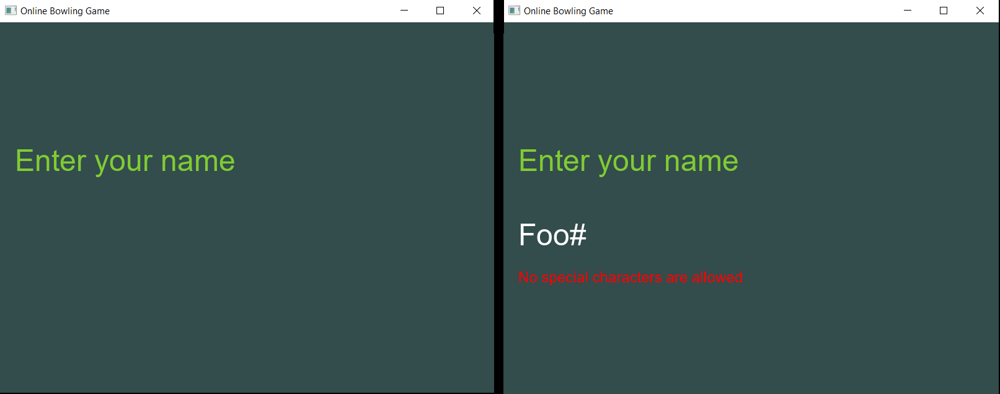
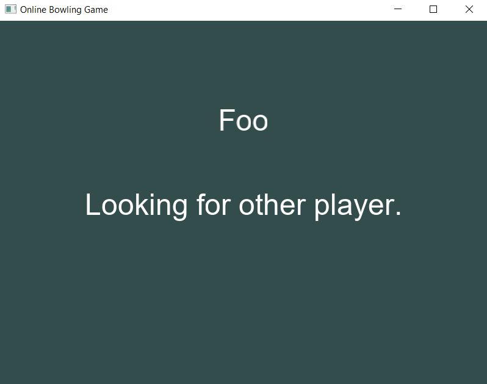
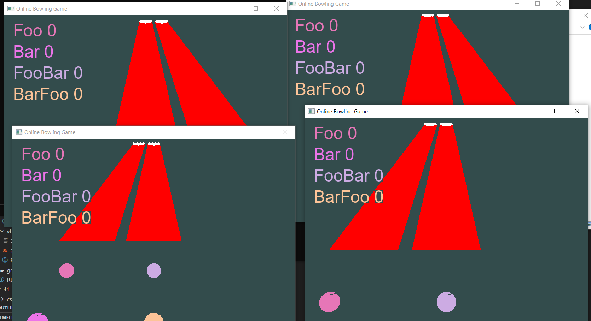
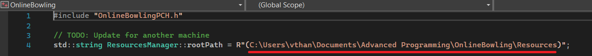

# 3D Online Bowling C++ from the ground up
This project presents the work of my assignment for Advanced Programming module
during my Master degree on Game Development and Design. I was asked to
develop a multiplayer game using C++. The provided skeleton code already had
the balls and a flat table so I tried to follow the theme to make it 3D Online
(Multiplayer) Bowling game. After 2 weeks straight, I can made this functioning
and now I spend some spare time after submitting all the works to write a
summary.

Project info:
1. Programming Language: MSVC++
2. Development environment: Microsoft Windows 10, Version 1909
3. IDE: Microsoft Visual Studio 2022

### Screenshots

### How to run the code
Firstly, you need to clone the code into your local machine. Then you need
to update the path to main resources (shaders/fonts) that are used in the game.
I didn't have enough time to add flexibility to this at the time.

