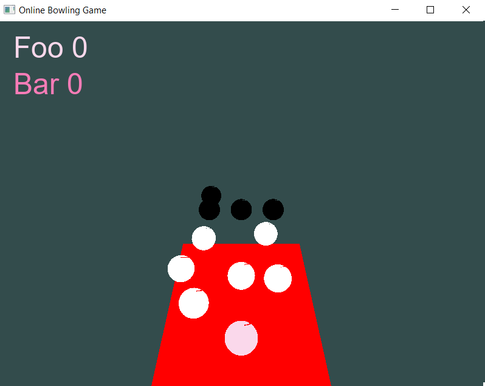

# 3D Online Bowling C++ from the ground up
This project presents the work of my assignment for Advanced Programming module
during my Master degree on Game Development and Design. I was asked to
develop a multiplayer game using C++. The provided skeleton code already had
the balls and a flat table so I tried to follow the theme to make it 3D Online
(Multiplayer) Bowling game. After 2 weeks straight, I can made this functioning
and now I spend some spare time after submitting all the works to write a
summary.

Project info:
1. Programming Language: MSVC++
2. Development environment: Microsoft Windows 10, Version 1909
3. IDE: Microsoft Visual Studio 2022

## Screenshots

## How to run the code
Firstly, you need to clone the code into your local machine. Then you need
to update the path to main resources (shaders/fonts) that are used in the game.
I didn't have enough time to add flexibility to this at the time.

OK. Hit Build solution and let's play. Run the batch file `RunAll.bat` in the build folder.

    start cmd.exe /c OnlineBowlingServer.exe 45000
    start cmd.exe /c OnlineBowlingClient.exe
    start cmd.exe /c OnlineBowlingClient.exe

## Components
### Game logic: Do you know what are the rules of a typical bowling game?
No? Don't worry, me too 😂. Watch this:
[The Rules of Ten Pin (10 Pin) Bowling - EXPLAINED!](https://www.youtube.com/watch?v=E2d8PizMe-8).
Thanks, [Ninh Ly](https://www.youtube.com/channel/UCTiEIvYaXBTcu2b9viRB7lg) YouTube channel.
I definitely wanted to go for a bowling game after the exam season. Now I don't have to wonder 
why the score is increased randomly.

### How to draw things?
When it come to drawing on desktop, there are big chance that you will hear about OpenGL.
I also used it in this project to draw game objects. At the time of writing this summary,
I have only learnt OpenGL for a month from this legendary site 
[Learn OpenGL](https://learnopengl.com/) by [Joey de Vries](http://joeydevries.com/).
He is really good at explaining OpenGL concepts with code examples.

I also stole (who doesn't? 😋) some codes from [OpenGL Sphere](http://www.songho.ca/opengl/gl_sphere.html)
by [Song Ho Ahn](https://disqus.com/by/songho/?) to help me draw beautiful spheres.

### The most frustrating part: Networking
How do we gather different people on the internet into one single game? I have no idea
at first but I found this gem [Multiplayer Game Programming](https://www.amazon.co.uk/Multiplayer-Game-Programming-Architecting-Networked/dp/0134034309).
I just wanted to say thank you to [Sanjay Madhav](https://www.amazon.co.uk/Sanjay-Madhav/e/B00D9FUNHI?ref_=dbs_p_pbk_r00_abau_000000)
and [Josh Glazer](https://www.amazon.co.uk/Josh-Glazer/e/B017FXHMRI?ref_=dbs_p_pbk_r00_abau_000000).
Without this book, I couldn't finish my assignment on time and thinking I'm stupid 😅.